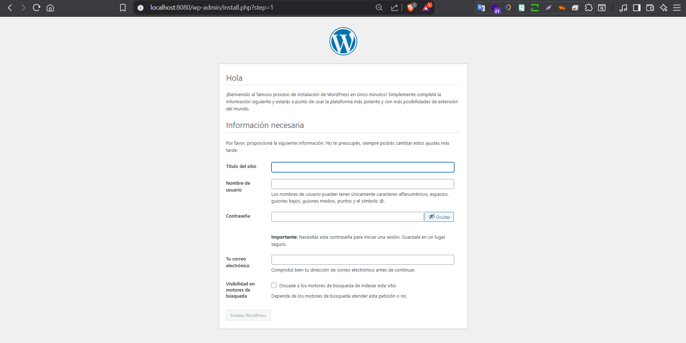
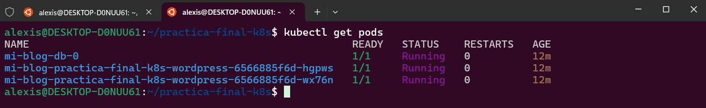
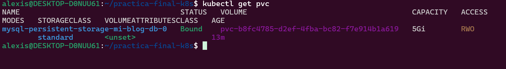
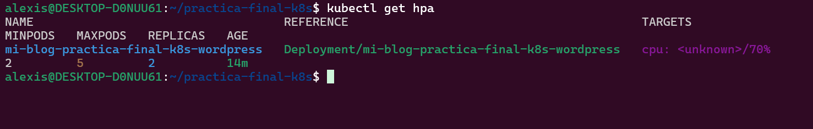

# Chart de Helm para Despliegue de WordPress en Kubernetes

Este repositorio contiene un Chart de Helm completo para desplegar una aplicación WordPress con una base de datos MySQL en un clúster de Kubernetes. El proyecto ha sido desarrollado como entrega para el curso de KeepCoding, cumpliendo con todos los requisitos de la práctica.

## Características Principales

Este chart ha sido diseñado siguiendo las mejores prácticas de Kubernetes para asegurar un despliegue robusto, escalable y seguro:

*   **Alta Disponibilidad:** El despliegue de WordPress está configurado con múltiples réplicas (`replicaCount`) para garantizar que la aplicación esté siempre disponible.
*   **Escalado Automático:** Se utiliza un `HorizontalPodAutoscaler` (HPA) para escalar automáticamente el número de pods de WordPress en función del uso de la CPU, con un umbral configurable.
*   **Persistencia de Datos:** La base de datos MySQL utiliza un `StatefulSet` junto con un `PersistentVolumeClaim` (PVC) para garantizar que los datos se almacenen de forma duradera y sobrevivan a reinicios de los pods.
*   **Gestión de Secretos:** Todas las credenciales sensibles (contraseñas de la base de datos) se gestionan de forma segura a través de un `Secret` de Kubernetes, evitando exponer información sensible en el código.
*   **Resiliencia y Auto-reparación:** Se han configurado `livenessProbes` y `readinessProbes` tanto para WordPress como para MySQL. Esto permite a Kubernetes detectar cuándo un contenedor no responde, reiniciarlo automáticamente y evitar enviarle tráfico hasta que esté listo.
*   **Configuración Centralizada:** Todo el despliegue es fácilmente configurable a través del fichero `values.yaml`, siguiendo las convenciones de Helm.

## Arquitectura del Despliegue

La aplicación se despliega utilizando los siguientes objetos de Kubernetes:

*   **Deployment:** Para gestionar los pods de WordPress, ya que es una aplicación sin estado (stateless).
*   **StatefulSet:** Para gestionar el pod de la base de datos MySQL, garantizando una identidad de red estable y un almacenamiento persistente ordenado.
*   **Services:**
    *   Un servicio `ClusterIP` para exponer WordPress a otros componentes dentro del clúster.
    *   Un servicio `Headless` para la base de datos, que permite el descubrimiento directo de los pods del StatefulSet.
*   **Ingress:** Para exponer el servicio de WordPress al exterior del clúster.
*   **Secret:** Para inyectar de forma segura las credenciales de la base de datos.
*   **HorizontalPodAutoscaler (HPA):** Para gestionar el escalado automático del Deployment de WordPress.
*   **PersistentVolumeClaim (PVC):** Para solicitar almacenamiento dinámicamente para el StatefulSet de MySQL.

## Requisitos Previos

*   Un clúster de Kubernetes funcional (ej. Docker Desktop, Minikube).
*   Helm v3+ instalado.
*   `git` para clonar el repositorio.

## Instalación del Chart

1.  **Clonar el repositorio:**
    ```bash
    git clone https://github.com/KeepCodingCloudDevops12/SisnerosAlexis_PracticaFinal_K8S
    cd practica-final-k8s
    ```

2.  **Instalar el chart con Helm:**
    Utiliza el siguiente comando para desplegar la aplicación. Puedes reemplazar `mi-blog` con el nombre de release que prefieras.

    ```bash
    helm install mi-blog .
    ```

### Nota Importante sobre el Acceso a la Aplicación en Docker Desktop

El Ingress Controller que viene integrado con Docker Desktop a veces puede tardar en asignar una dirección IP al recurso Ingress, o no hacerlo correctamente.

Para garantizar el acceso y poder verificar el funcionamiento de la aplicación de forma inmediata y fiable, se recomienda utilizar `kubectl port-forward`. Este comando crea un túnel de red directo al servicio de la aplicación, saltándose la capa del Ingress.

1.  **Abrir un nuevo terminal y ejecutar:**
    ```bash
    kubectl port-forward svc/mi-blog-practica-final-k8s 8080:80
    ```

2.  **Acceder a la aplicación:**
    Abre tu navegador web y navega a **`http://localhost:8080`**.

## Verificación del Despliegue

A continuación se muestra la evidencia visual del correcto funcionamiento del despliegue:

### 1. Aplicación WordPress Accesible

La aplicación se despliega correctamente y muestra la página de instalación inicial, demostrando que WordPress está en marcha y se ha conectado con éxito a la base de datos MySQL.



### 2. Pods en Estado "Running" y "Ready"

Todos los pods del despliegue (1 para MySQL y 2 para WordPress) se encuentran en estado `Running` y `Ready (1/1)`, indicando que han pasado sus sondas de salud.



### 3. Persistencia de Datos Configurada

El `PersistentVolumeClaim` (PVC) para la base de datos ha sido creado y se encuentra en estado `Bound`, confirmando que el almacenamiento persistente está funcionando.



### 4. Autoescalado (HPA) Configurado

El `HorizontalPodAutoscaler` (HPA) está activo y monitorizando el uso de CPU del despliegue de WordPress, con la configuración de réplicas mínimas/máximas y el umbral de CPU definidos en el `values.yaml`.



## Configuración

Los principales parámetros del chart se pueden configurar en el fichero `values.yaml`:

| Parámetro                                    | Descripción                                                                 | Valor por Defecto                         |
| -------------------------------------------- | --------------------------------------------------------------------------- | ----------------------------------------- |
| `wordpress.image.tag`                        | La versión (tag) de la imagen de WordPress a utilizar.                      | `"6.5.3-apache"`                          |
| `wordpress.replicaCount`                     | Número de réplicas iniciales para WordPress.                                | `2`                                       |
| `wordpress.autoscaling.enabled`              | Habilita o deshabilita el autoescalado (HPA).                               | `true`                                    |
| `wordpress.autoscaling.minReplicas`          | Número mínimo de réplicas para el HPA.                                      | `2`                                       |
| `wordpress.autoscaling.maxReplicas`          | Número máximo de réplicas para el HPA.                                      | `5`                                       |
| `wordpress.autoscaling.targetCPUUtilizationPercentage` | Porcentaje de uso de CPU para disparar el escalado.                | `70`                                      |
| `wordpress.ingress.host`                     | El nombre de dominio para acceder a la aplicación.                          | `wordpress.127-0-0-1.nip.io`              |
| `mysql.image.tag`                            | La versión (tag) de la imagen de MySQL.                                     | `"8.0"`                                   |
| `mysql.auth.rootPassword`                    | Contraseña para el usuario `root` de MySQL (se recomienda cambiar).        | `"changeme-root-password"`                |
| `mysql.auth.password`                        | Contraseña para el usuario de WordPress (se recomienda cambiar).           | `"changeme-wordpress-password"`           |
| `mysql.persistence.size`                     | Tamaño del volumen persistente para la base de datos.                       | `5Gi`                                     |

## Desinstalación del Chart

Para desinstalar completamente el despliegue, ejecuta el siguiente comando:

```bash
helm uninstall mi-blog